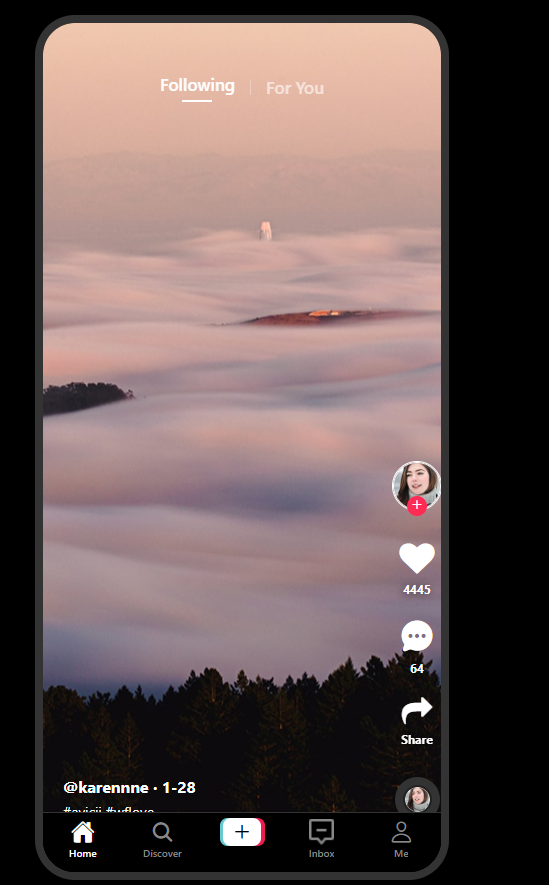
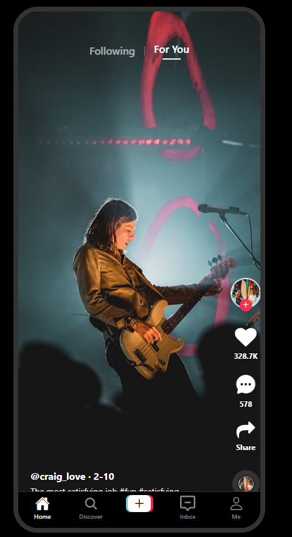
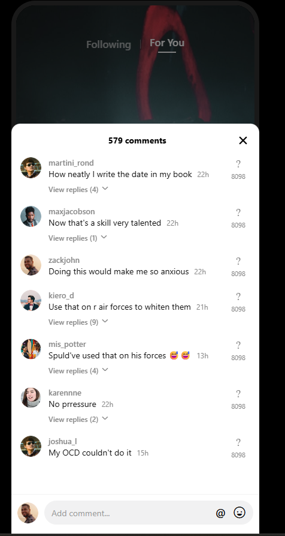

# 📱 Bài kiểm tra ngày 09/04/2026

## 👤 Thông tin sinh viên
- Họ và tên: Dặng Quốc Hải
- MSSV: 23810310354
- Môn học: Lập trình trên thiết bị di động

---

## 📌 Nội dung bài thực hành
 Hoàn thiện layout các màn hình: https://prnt.sc/wcNjWIgrp8ZV
TikTok Home (Following)
TikTok Home (For You)
TikTok Comments
- Sử dụng 

Top Tabs Navigator để di chuyển giữa 2 màn hình TikTok Home (Following) <-> TikTok Home (For You)
- Sử dụng Bottom Tabs Navigator để di chuyển qua màn hình TikTok Comments (khi người dùng click vào icon comment trên Bottom Menu
## 🚀 Hướng dẫn chạy project
Để chạy được project này trên máy tính, bạn cần thực hiện các bước sau:

1. Yêu cầu hệ thống
Đã cài đặt Node.js (phiên bản LTS).

Đã cài đặt Git.

2. Cài đặt thư viện
Mở terminal tại thư mục gốc của project và chạy lệnh:

Bash
npm install
(Hoặc yarn install nếu bạn dùng Yarn)

3. Chạy project
Sau khi cài đặt xong, khởi động server Expo:

Bash
npx expo start
4. Xem kết quả
Trên Web: Nhấn phím w sau khi chạy lệnh start.

Trên Điện thoại: - Cài ứng dụng Expo Go (trên App Store hoặc CH Play).

Dùng camera điện thoại quét mã QR hiện ra trên terminal (Lưu ý: Điện thoại và máy tính phải dùng chung một mạng Wi-Fi).

## 📷 Kết quả chạy chương trình

---
